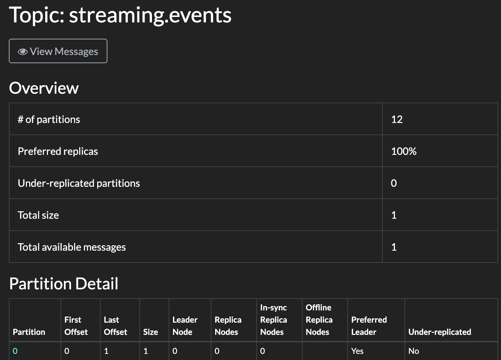
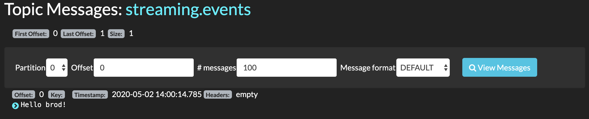

# BrodSample

## Kafka
For this, we assume you have Kafka up and running at `localhost:9092`

I'm using this docker-compose: `https://github.com/obsidiandynamics/kafdrop/blob/master/docker-compose/kafka-kafdrop/docker-compose.yaml` to have Kafdrop running and be able to create topics through a UI on `localhost:9000`

Using Kafdrop I created a topic called `streaming.events` with 12 partitions

## Dependency
First thing you'll need is to add brod to your dependencies
To find the latest version published on hex, run: `mix hex.search brod`

As of writing this, the output was:
```
➜  brod_sample git:(master) ✗ mix hex.search brod
Package                 Description                                            Version  URL                                             
brod                    Apache Kafka Erlang client library                     3.10.0   https://hex.pm/packages/brod  
```

Now just add it to your deps on `mix.exs`
```
defp deps do
    [
      {:brod, "~> 3.10.0"}
    ]
end
```

## Client configuration
We need to setup a client to be used by our consumer and producer, so the first thing we are going to do is to set this up by using configuration
Let's use our `dev.exs` to set this up by adding the following:

```
import Config

config :brod,
  clients: [
    kafka_client: [
      endpoints: [localhost: 9092]
    ]
  ]
```

Here we are setting a client named `kafka_client`, you can choose whatever name you like for this, we are also configuring the endpoints to our kafka cluster, in production you are ideally setting up multiple endpoints of your broker, something like:

```
import Config

config :brod,
  clients: [
    kafka_client: [
      endpoints: [192.168.0.2:9092,192.168.0.3:9092,192.168.0.4:9092]
    ]
  ]
```

Now with the `kafka_client` in place we can look at how to publish and consumer those messages

## Publisher

To send a message with brod we can use the `produce_sync` function, you can take a better look at the docs and see this and other possibilities at: https://hexdocs.pm/brod/brod.html#produce_sync-5

Now, lets make a module to allow us publishing to Kafka

```
defmodule BrodSample.Publisher do
  def publish(topic, partition, partition_key, message) do
    :brod.produce_sync(
      :kafka_client,
      topic,
      partition,
      partition_key,
      message
    )
  end
end
```

Now, if we try to publish a message now it will return us, `{:error, {:producer_not_found, "sample"}}`, the error is clearly showing that it didn't found a producer, so we need to configure brod to start our producer

Luckily we can also use configuration to tell brod to automatically start our producers by changing our config to:

`dev.exs`
```
import Config

config :brod,
  clients: [
    kafka_client: [ 
      endpoints: [localhost: 9092],
      auto_start_producers: true  # This will auto-start the producers with default configs
    ]
  ]

```


Now let's run and give it a try
```
➜  brod_sample git:(master) ✗ iex -S mix
Erlang/OTP 22 [erts-10.7.1] [source] [64-bit] [smp:12:12] [ds:12:12:10] [async-threads:1] [hipe]


10:58:41.442 [info]  [supervisor: {:local, :brod_sup}, started: [pid: #PID<0.210.0>, id: :kafka_client, mfargs: {:brod_client, :start_link, [[localhost: 9092], :kafka_client, [endpoints: [localhost: 9092], auto_start_producers: true]]}, restart_type: {:permanent, 10}, shutdown: 5000, child_type: :worker]]
Interactive Elixir (1.10.2) - press Ctrl+C to exit (type h() ENTER for help)
iex(1)> 
```

Now, we can use our module, doing
`iex(1)> BrodSample.Publisher.publish("streaming.events", 0, "", "Hello brod!")`
If everything worked, brod will return a `:ok`

So this sent the message `"Hello brod!"` to the topic named `"streaming.events"` on the partition number 0 and an empty partition key

Let's take a look at kafdrop



We can see that there is something on partition 0

Opening it up we see


### Using partition key

The most common way to send messages to kafka is by using a partition key and based on that deciding to what partition the message should go, let's see how we can achieve that

First, we need to know how many partitions our topic have, so we don't try sending the message to a non-existing partition, for that we can also use brod
`{:ok, count} = :brod.get_partitions_count(client, topic_name)`

Now with this information, we need to make sure that the same partition key always go to the same topic, we can achieve this by using phash2 included on erlang
`:erlang.phash2(key, count)`

This will return a number based on the key argument and not being bigger than the `count` we pass to it

Taking all of that into our module we have the following

```
defmodule BrodSample.Publisher do
  def publish(topic, partition_key, message) do
    :brod.produce_sync(
      :kafka_client,
      topic,
      :hash,
      partition_key,
      message
    )
  end
end
```
Let's take it for a spin
```
iex(2)> recompile
Compiling 1 file (.ex)
:ok
iex(3)> BrodSample.Publisher.publish("streaming.events", "my_key", "Hello brod!")
:ok
```

Now we can see on kafdrop that this message was sent to partition 1 due to its key


## Consumers

Now we need to get those messages and do something with

First what we need is to define a group of subcribers to our topic, brod provides us an implementation called `group_subscriber_v2` which will create a worker for each partition of our topic, this not only allow us to have a better troughput, but in case one of these paritions end up having problems only that worker will be affected.

Let's take a look at the docs of the `group_subscriber_v2` at https://hexdocs.pm/brod/brod_group_subscriber_v2.html
The first thing we can see is that it has some required functions and some optional.

Required callback functions: `init/2`, `handle_message/2`.
Optional callback functions: `assign_partitions/3`, `get_committed_offset/3`, `terminate/2`.

So lets start creating a module with the `group_subscriber_v2` behaviour

```
defmodule BrodSample.GroupSubscriberV2 do
  @behaviour :brod_group_subscriber_v2
end
```

Now we need to implement at least the `init/2` and `handle_message/2`, let's start off simple

```
defmodule BrodSample.GroupSubscriberV2 do
  @behaviour :brod_group_subscriber_v2
  def init(_arg, _arg2) do
    {:ok, []}
  end

  def handle_message(message, state) do
    IO.inspect(message, label: "message")
    {:ok, :commit, []}
  end
end
```

We created a basic init, and our `handle_message/2` will simply inspect the message and then ack that message on Kafka

Now you might be wondering, where is the configurations? Consumer group, topics, begin offset?

Well, we now need to define all of those and tell brod to use this module as the callback module, what we want to do is call `:brod.start_link_group_subscriber_v2(config)` with the correct configurations.

This can be done the following way.

```
    group_config = [
      offset_commit_policy: :commit_to_kafka_v2,
      offset_commit_interval_seconds: 5,
      rejoin_delay_seconds: 2,
      reconnect_cool_down_seconds: 10
    ]

    config = %{
      client: :kafka_client,
      group_id: "consumer_group_name",
      topics: ["streaming.events"],
      cb_module: BrodSample.GroupSubscriberV2,
      group_config: group_config,
      consumer_config: [begin_offset: :earliest]
    }

    {:ok, pid} = :brod.start_link_group_subscriber_v2(config)
```
Theres a lot of information in here, so let's take a look on the most important ones.

### client
Expects the identifier of your kafka client, remeber that we configure `:kafka_client` on the `dev.exs`, here we are just referencing that client that we already configured.

### group_id
This is the name of the consumer_group that will be used

### cb_module
The module where you defined the `init/2` and `handle_message/2`

### group_config
The configurations to use for the group coordinator

### consumer_config
Configurations for the partition consumer, here we only defined the `begin_offset` to `:earliest`, this means that our consumer will start from the earliest message available on the topic, you can also use `:latest` to start with the latests message available (This basically means that your consumer group will only get messages after it comes online)

After all of that we call `{:ok, pid} = :brod.start_link_group_subscriber_v2(config)` and that's it, brod will now start a worker for each partition our topic has and start consuming messages.

You should now see on your console all the messages you've sent earlier

## Warning
If you are not running your application in cluster mode you may go into some issues as the `group_subscriber` on multiple nodes may force each other re-join the group, if you wish to simulate this you can start 
